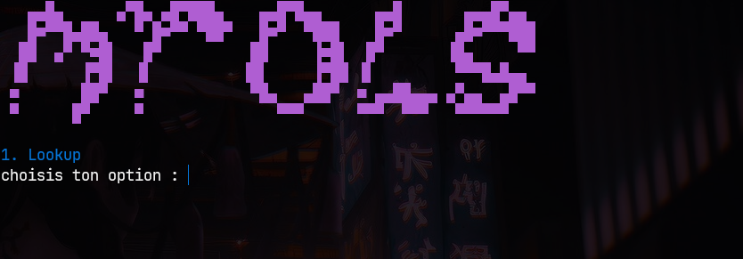
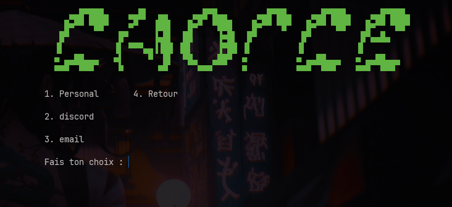

# MTOLS

**MTools est un outil en ligne de commande qui regroupe plein de petits outils
de recherche en un seul programme.**

> ### ⚠️ Statut du projet : **développement en cours**
>
> Ce que tu vois ici, c'est **un tout début**. MTools n'est pas fini et il ne
> l'est pas encore complet.
>
> Concrètement, pour l'instant **un seul module** est prêt (le `Lookup`).
> Mais MTools est prévu pour devenir **un gros outil** qui regroupent
> beaucoup plus de choses : d'autres modules, une vraie interface, un
> installeur, des options, etc.
>
> **Le projet grandit un peu chaque jour.** Les nouvelles fonctionnalités
> arrivent au fur et à mesure. Reviens régulièrement pour voir ce qu'il y a de
> neuf !

---

## Table des matières

1. [C'est quoi MTools ?](#cest-quoi-mtools-)
2. [Ce que MTools sait faire aujourd'hui](#ce-que-mtools-sait-faire-aujourdhui)
3. [Qui peut l'utiliser ?](#qui-peut-lutiliser-)
4. [Ce qu'il te faut pour commencer](#ce-quil-te-faut-pour-commencer)
5. [Installation (pas à pas)](#installation-pas-à-pas)
6. [Les commandes](#les-commandes)
7. [Comment utiliser MTools](#comment-utiliser-mtools)
8. [Captures d'écran](#captures-décran)
9. [À quoi sert chaque fichier ?](#à-quoi-sert-chaque-fichier-)
10. [En cas de problème](#en-cas-de-problème)
11. [La vision du projet](#la-vision-du-projet)

---

## C'est quoi MTools ?

Imagine un **boîte à outils**. Au lieu d'avoir 15 programmes différents
 ouverts en même temps, tu as **un seul programme** qui contient plein
d'outils, tous regroupés au même endroit.

Aujourd'hui, MTools contient **un seul outil**, le **Lookup** (la recherche).
Mais l'idée, c'est d'en ajouter beaucoup d'autres avec le temps.

MTools est fait en **2 langages** :

| Langage | Ça sert à quoi ? |
|---|---|
| **C** | Le menu principal, l'affichage, le démarrage du programme |
| **Python** | La recherche sur internet (c'est lui qui envoie les requêtes) |

**Seulement compatible avec Windows pour le moment.**

---

## Ce que MTools sait faire aujourd'hui

Le module **Lookup** envoie une recherche sur l'API `brixhub` et affiche
les résultats dans ton terminal.

Tu peux chercher par :

| N° | Type de recherche | Ce que tu tapes |
|---|---|---|
| 1 | **Personne** | Nom de famille + prénom |
| 2 | **Discord** | Un identifiant Discord (son ID numérique) |
| 3 | **Email** | Une adresse email |

---

## Qui peut l'utiliser ?

**Tout le monde.** Tu n'as pas besoin d'être développeur.

- 🟢 **Débutant** ? Suis simplement la section [Installation](#installation-pas-à-pas),
  et colle les commandes **telles quelles**. Tout est expliqué étape par étape.
- 🟡 **Quelqu'un qui se débrouille** ? Va directement à
  [Les commandes](#les-commandes).
- 🔵 **Développeur** ? Regarde [À quoi sert chaque fichier ?](#à-quoi-sert-chaque-fichier-)
  et les autres fichiers `.c` / `.py` pour t'amuser.

> ⚖️ **Petit rappel important :** cet outil affiche des informations
> personnelles (nom, Discord, email). Utilise-le uniquement sur des données
> dont **tu as le droit** l'accès, dans un cadre **légal** (ton propre compte,
> une enquête qui t'a été confiée, un test de sécurité autorisé, une
> protection anti-fraude à ton propre compte…). Ne l'utilise **pas** pour
> harceler, surveiller ou nuire à quelqu'un.

---

## Ce qu'il te faut pour commencer

Trois choses. C'est tout.

1. **Windows** — l'outil ne fonctionne pas sur Linux ni macOS pour l'instant.
2. **[Python 3](https://www.python.org/)** — le langage qui fait les recherches.
   - ⚠️ **Coche la case « Add Python to PATH »** pendant l'installation,
     sinon ça ne marchera pas.
3. **[MinGW-w64](https://www.mingw-w64.org/)** — pour transformer le code en
   programme (`tools.exe`).
   - Le plus simple : installe-le via
     [Chocolatey](https://chocolatey.org/) avec la commande
     `choco install mingw make`

### Le saviez-vous ?

Tu n'as **pas besoin** d'installer Python ou MinGW si un ami t'a déjà envoyé
le fichier `tools.exe` tout compilé. Tu peux directement double-cliquer dessus.

---

## Installation (pas à pas)

Ouvre ton terminal. Sur Windows : tape `cmd` dans le menu Démarrer, puis
**Entrée**. Place-toi dans le dossier du projet (celui qui contient `menu.c`).

### Étape 1 — Installe tout et compile

```bash
make
```

Cette seule commande fait **les trois choses suivantes** automatiquement :

1. Installe les dépendances Python listées dans `requirements.txt`
   (`requests` et `colorama`).
2. Compile le code C.
3. Te sort l'exécutable `tools.exe`.

Quand c'est fini, tu dois voir :

```
[OK] Compilation terminee : tools.exe
```

### Étape 2 — Lance l'outil

Double-clique sur `tools.exe`, ou tape :

```bash
tools.exe
```

Et voilà, le menu s'affiche. 🎉

---

## Les commandes

Tu as **une seule commande à retenir** : `make`. Le reste, c'est en option.

| Tu veux... | Tape cette commande |
|---|---|
| **Tout installer et compiler** | `make` |
| Juste installer les dépendances | `make deps` |
| Juste compiler (sans réinstaller) | `make build` |
| Compiler **et** lancer l'outil | `make run` |
| **Supprimer** les fichiers générés | `make clean` |
| Voir la liste des commandes | `make help` |

### Les 2 commandes essentielles

#### `make` — installer + compiler

Celle-là, tu la lances quand tu veux **construire** le projet. Au premier
lancement, c'est celle qu'il te faut.

#### `make clean` — tout nettoyer

**À quoi ça sert ?** Après avoir compilé, le dossier contient des fichiers
générés (`tools.exe`, et plein de `.o`). Ce sont des fichiers *temporaires* :
ils servent à rien une fois le programme compilé, et ils peuvent être
cassés ou périmés.

`make clean` les supprime pour repartir d'une page blanche.

**Quand l'utiliser ?**

- Tu veux **reconstruire le projet** depuis zéro (après une modif, c'est
  souvent plus sûr).
- Tu as un **problème bizarre** et tu veux tout repartir de zéro.
- Tu veux **garder ton dossier propre** avant de l'envoyer / le sauvegarder.

---

## Comment utiliser MTools

### Étape 1 — Le menu principal

Au lancement, le logo **MTools** s'affiche en couleur, avec une seule
option pour le moment :



```
1. Lookup          → ouvre le module de recherche
```

Tape `1` puis **Entrée**.

### Étape 2 — Le menu Lookup

Un second menu apparaît, en vert, avec **4 options** :



```
1. Personal       4. Retour
2. discord
3. email

Fais ton choix :
```

- Choisis **1**, **2** ou **3** selon ce que tu cherches.
- Choisis **4 (Retour)** pour revenir au menu principal.

### Étape 3 — La recherche

Le programme te pose ses questions une par une (par exemple le nom, puis le
prénom, puis le nombre de pages), et affiche ensuite les résultats.

**Petite explication sur les terms :**

| Mot | Ça veut dire |
|---|---|
| **API** | Un autre programme sur internet à qui MTools demande de chercher |
| **Résultat / Response** | Ce que l'API renvoie quand tu poses une question |
| **Terminal** | La fenêtre noire où tu tapes tes commandes |
| **Exécutable (`.exe`)** | Le programme compilé, prêt à être double-cliqué |
| **Compiler** | Transformer le code source en programme utilisable |
| **Dépendance** | Un autre programme nécessaire au fonctionnement |
| **`Make`** | L'outil qui automatise la compilation (via le `Makefile`) |
| **`Makefile`** | Le fichier qui dit à `make` quoi faire |

> 💡 Les résultats s'affichent avec **un petit délai d'une seconde entre
> chaque champ**, c'est fait exprès pour que ce soit plus lisible à l'œil.

---

## Captures d'écran

Voici à quoi ressemble MTools une fois lancé. Si l'image ne s'affiche pas,
c'est juste un souci d'affichage de la page — l'outil, lui, fonctionne.

| Menu principal | Menu Lookup |
|---|---|
|  |  |
| Le menu de base. Tape `1` pour entrer dans le Lookup. | Le menu des recherches : `1` Personne, `2` Discord, `3` Email, `4` Retour. |

> 📸 **Pour ajouter tes propres images** : dépose-les dans le dossier
> `images/`, puis ajoute une ligne avec la syntaxe ci-dessous.
>
> ```markdown
> 
> ```

---

## À quoi sert chaque fichier ?

```
mtools/
├── menu.c            ← Le menu principal (écrit en C)
├── Makefile          ← Les commandes automatisées (make, make clean)
├── requirements.txt  ← La liste des dépendances Python à installer
├── README.md         ← Ce fichier
├── tools.exe         ⬅ (généré) L'exécutable, créé par `make`
│
├── include/          ⬅ Dossier vide pour le moment
│                      (il servira plus tard pour les fichiers .h)
│
├── images/           ⬅ Les captures d'écran affichées dans ce README
│   ├── menu.png        (le menu de base)
│   └── lookup.png      (le menu Lookup)
│
└── src/
    └── python/
        └── lookup.py ← Le module Lookup (écrit en Python)
```

**En résumé :**

- **`menu.c`** → le point de départ. Affiche le logo et le menu, puis lance le
  Python. C'est lui qui "pilote" tout.
- **`src/python/lookup.py`** → le cerveau. C'est lui qui pose les questions,
  envoie la recherche et affiche les résultats.
- **`Makefile`** → l'automatisation. dit à `make` comment compiler et nettoyer.
- **`requirements.txt`** → la liste des outils Python dont le projet a besoin.
- **`images/`** → les captures d'écran. Ajoute les tiennes ici, puis
  référence-les dans ce README.
- **`include/`** → dossier prêt pour la suite du projet.

---

## En cas de problème

### 😕 `'make' n'est pas reconnu en tant que commande interne`

MinGW n'est pas installé ou pas dans le PATH. Installe-le :
`choco install mingw make`, puis **redémarre ton terminal**.

### 😕 `'py' n'est pas reconnu en tant que commande interne`

Python n'est pas installé, ou tu as oublié de cocher **« Add Python to PATH »**.
Réinstalle Python en cochant cette case.

### 😕 `'gcc' n'est pas reconnu en tant que commande interne`

MinGW n'est pas dans le PATH. Assure-toi d'avoir lancé la commande
**dans le dossier du projet** (celui avec `menu.c`).

### 😕 Le programme ne se lance pas / se ferme direct

Lance-le **depuis le terminal**, pas en double-cliquant : tu verras le
message d'erreur. Et vérifie que tu es bien dans le bon dossier.

### 😕 J'ai une erreur bizarre

Essaie ça, dans cet ordre :

```bash
make clean
make
```

Ça efface tout et reconstruit le projet à zéro. Ça règle 9 fois sur 10
les problèmes liés à une compilation mal particielle.

### 💡 Tu es sur macOS ou Linux ?

Ça ne marche pas encore (le code C utilise des commandes Windows).
Garde un œil sur le projet, le multi-OS est prévu pour plus tard !

---

## La vision du projet

MTools est au **tout début** de son histoire. Voici où ça va :

### ✅ Déjà fait

- [x] Menu principal en C, avec logo coloré
- [x] Module **Lookup** (recherche par nom, Discord, email)
- [x] `Makefile` pour compiler / nettoyer en une commande
- [x] `requirements.txt` pour les dépendances

### 🚧 En cours

- [ ] Agrandir le fichier `include/`
- [ ] Plus d'options dans le menu
- [ ] Gérer mieux les erreurs de l'API
- [ ] Ajouter des captures d'écran dans `images/`

### 🌱 À venir

- [ ] **Beaucoup** de nouveaux modules
- [ ] Une vraie interface graphique (plus besoin du terminal)
- [ ] Un installeur en un clic
- [ ] Compatibilité macOS / Linux
- [ ] Documentation de chaque module

> 🗓️ **Ce projet évolue un peu tous les jours.** Si tu as une idée, une
> suggestion ou que tu veux aider : les contributions sont les bienvenues !

---

## Avertissement

MTools est un projet **en cours de développement**. Il est fourni « tel quel »,
sans aucune garantie : le code peut encore contenir des bugs, le menu peut
changer, et de nouvelles fonctionnalités arrivent en permanence.

Utilise l'outil de manière **responsable et légale**. Tu es seul responsable
de l'usage que tu fais des informations récupérées.

---

*MTools — un petit départ, un grand projet.* 🌱